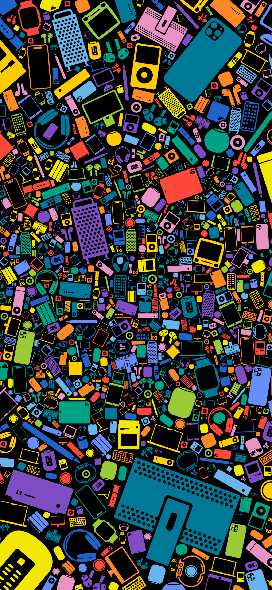

# FAQ

well, not really

<figure><figcaption></figcaption></figure>

<figure><figcaption>
Ubuntu
</figcaption></figure>

<figure><figcaption></figcaption></figure>

<figure><figcaption>
GB
</figcaption></figure>

<figure><figcaption></figcaption></figure>
